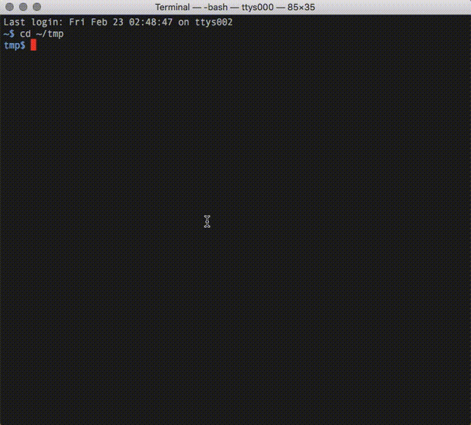

[](https://github.com/callmekohei/tigaDebugger/blob/master/LICENSE)

[](https://gitter.im/vim-jp/reading-vimrc)

# sdbplg

[mono/sdb](https://github.com/mono/sdb) plugins

<br>
<br>

## ScreenShot



## Installing
sdbplg requires mono and mono/sdb installed.

```
$ git clone --depth 1 https://github.com/callmekohei/sdbplg
```

## About Compile
```
$ bash build.bash
```

## Set Path
Put the following string to `.bash_profile`
```
export SDB_PATH=/PATH/TO/sdbplg/bin/bin
```

## Usage
```
// create foo.fsx
$ vim foo.fsx

let foo() =
    let mutable x = 1
    x <- 2
    x <- 3
    x

[<EntryPointAttribute>]
let main _ =
    let y = foo()
    stdout.WriteLine(y)
    0

// compiel file
$ fsharpc -g --optimize- foo.fsx

// open file
$ sdb 'run foo.exe'

// set break point
(sdb) bp add func Foo.main

// start debug
(sdb) r

// step in
(sdb) foo stepin

// step over
(sdb) foo stepover

// step out
(sdb) foo stepout

// continue
(sdb) foo continue

// quit
(sdb) quit
```

### Shortcut

Put the following to `$HOME/.sdb.rc
```
$ vim .sdb.rc

alias add n foo stepover
alias add i foo stepinto
alias add u foo stepout
alias add c foo stepcontinue
alias add r foo run
```
